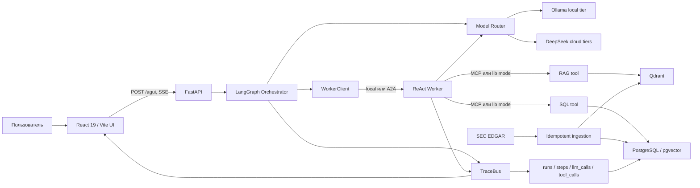

# LedgerLens: актуальная карта проекта

Дата среза: 2026-07-11 (Europe/Moscow)

Репозиторий: `E:\projects\platform`

Проверенный commit: `3d61431` (`main == origin/main`)

## 1. Короткий вывод

LedgerLens — self-hosted мультиагентная платформа финансового анализа. Она принимает вопрос на естественном языке, строит план, делегирует шаги ReAct-воркеру, извлекает числовые факты из PostgreSQL и нарративные фрагменты из Qdrant, после чего синтезирует ответ с цитатами и показывает ход выполнения через AG-UI.

Это уже не каркас: вертикальный срез G1 и MVP-гейт G2 пройдены; реализованы LangGraph-оркестратор, A2A, MCP, RAG, React UI, golden dataset и eval в GitHub Actions. Фактически подтверждённый продуктовый путь пока один — **US / SEC EDGAR**. RU-источники, цены, удалённая worker-нода, Grafana, n8n-monitoring и production-hardening остаются следующими этапами.

Текущая активная работа — T-041, устранение неподкреплённых retrieved-контекстом утверждений в RAG-ответах. В working tree уже лежит незакоммиченный кандидат: более строгий grounding prompt, детерминированный `_strip_ungrounded()` и пять новых unit-тестов. Один локальный `ci`-прогон дал `faithfulness=0.95`, но критерий закрытия требует не менее двух последовательных **full**-прогонов с `faithfulness >= 0.7`.

## 2. Фактическая архитектура

Основные узлы:

| Узел | Реализация | Статус |
|---|---|---|
| HTTP/API | `orchestrator/api.py` — `/api/chat`, `/agui`, `/api/examples`, `/healthz` | Работает |
| Оркестратор | `orchestrator/graph.py` — classify, plan, execute, assess, replan, synthesize, guardrail, finalize | Работает |
| Worker | `workers/react_worker.py` — ReAct-цикл, deadline/iteration budget, SQL/RAG tools | Работает; T-041 меняет grounding |
| Межагентный транспорт | `orchestrator/worker_client.py`, `workers/a2a_server.py` | A2A в compose; вторая нода ещё не подключена |
| Инструменты | `tools/sql`, `tools/rag` | MCP-сервисы и локальный lib fallback работают |
| Model routing | `model_router/router.py`, `config/router.yaml` | Ollama + DeepSeek; retry/fallback и structured-output repair |
| Данные | PostgreSQL 16/pgvector + Qdrant | Работает на US-корпусе |
| Адаптеры | `adapters/edgar` | EDGAR реализован; MOEX/ГИР БО/e-disclosure пока пустые каркасы |
| UI | `web/` | Рабочий SPA с EN/RU, планом, trace, цифрами и citations |
| Eval | `eval/`, `.github/workflows/eval*.yml` | 41 full / 10 ci кейсов, snapshot, baseline и PR-report |
| Ops | Docker Compose, JSON logs, DB trace | Grafana/n8n/CD/backup/rollback ещё отсутствуют |

## 3. Жизненный цикл одного вопроса

1. UI создаёт/переиспользует `session_id` и отправляет AG-UI `RunAgentInput` в `POST /agui` (`web/src/agent.ts:20-27`, `web/src/agent.ts:150-162`).
2. API создаёт строку `runs`, подписывает bounded queue на `TraceBus` и запускает run отдельной задачей, поэтому disconnect клиента не останавливает серверную работу (`orchestrator/api.py:188-235`, `orchestrator/api.py:245-317`).
3. LangGraph-классификатор создаёт одношаговый план для простого вопроса либо вызывает полноценный planner (`orchestrator/graph.py:222-269`).
4. Оркестратор последовательно выбирает первый готовый шаг, проверяет общий budget и формирует `WorkerTask` с разрешёнными инструментами (`orchestrator/graph.py:271-305`). Независимые шаги пока не параллелятся.
5. Worker запускает ReAct-цикл через `RouterChatModel`, подключая SQL/RAG по MCP либо напрямую как библиотеку (`workers/react_worker.py:82-156`, `workers/react_worker.py:356-467`).
6. SQL tool валидирует AST через sqlglot, допускает только read-only SELECT, добавляет LIMIT и работает под ролью `app_ro` (`tools/sql/core.py:94-139`, `tools/sql/core.py:220-254`).
7. RAG tool строит dense + sparse запрос, применяет RRF, cross-encoder rerank и возвращает chunks с citation metadata (`tools/rag/core.py:106-182`).
8. Оркестратор агрегирует evidence, извлекает key-values, ищет числовые противоречия и при `failed/no_data` делает replan (`orchestrator/graph.py:325-433`, `orchestrator/graph.py:552-598`).
9. Итог проходит synthesis и двухступенчатый non-advice guardrail. Trace преобразуется в debug SSE либо AG-UI events; стоимость агрегируется из `llm_calls` (`orchestrator/graph.py:445-541`, `orchestrator/persistence.py:102-151`).

## 4. Данные и ingestion

### PostgreSQL

Доменная миграция `db/versions/001_domain.py` создаёт:

- `companies`;
- `filings`;
- `financial_facts`;
- `latest_facts` — представление, выбирающее актуальную версию рестейтмента;
- `filing_sections`;
- `section_chunks` с `vector(1024)`.

Миграция `002_observability.py` добавляет `runs`, `steps`, `llm_calls`, `tool_calls`, `eval_runs`, `eval_results`, `monitored_events` и `prices`.

SQL-агент читает доменные таблицы через отдельную read-only роль `app_ro`. Session memory LangGraph хранится через `AsyncPostgresSaver`; его checkpoint-таблицы создаются runtime-кодом, а не Alembic.

### Qdrant и RAG

Основное retrieval-хранилище — коллекция Qdrant `narrative_chunks`. Используются multilingual E5 dense embeddings, BM25 sparse vectors и multilingual Jina reranker. pgvector заполняется опционально и сейчас нужен главным образом для связки и будущего benchmark.

### Ingestion

Фактический pipeline:

`SEC EDGAR -> disk cache/rate limiter -> normalize DTO -> idempotent PostgreSQL upsert -> section chunking -> embeddings -> Qdrant (+ optional pgvector)`.

EDGAR adapter соблюдает User-Agent, pacing, retry и disk cache. Повторный ingest использует natural keys и не должен создавать дубликаты (`ingestion/pipeline.py:20-63`, `ingestion/pipeline.py:124-185`).

## 5. Карта репозитория

| Путь | Назначение |
|---|---|
| `common/` | Settings, DB clients, доменные/agent DTO, logging, TraceBus, errors |
| `adapters/` | Pluggable data-source boundary; реальный код сейчас в `adapters/edgar/` |
| `ingestion/` | CLI, idempotent relational ingest, embeddings/reindex |
| `rag/` | Chunking, embedding/reranking и Qdrant indexer |
| `tools/sql/` | Read-only SQL core и MCP server |
| `tools/rag/` | Hybrid retrieval core и MCP server |
| `model_router/` | Tier selection, retry/fallback, structured JSON repair, LangChain facade |
| `workers/` | ReAct worker и A2A server |
| `orchestrator/` | LangGraph, API, AG-UI adapter, worker clients, persistence, guardrail |
| `web/` | React/Vite SPA, nginx, Playwright |
| `eval/` | Golden cases, scoring/judge, runner, reports |
| `db/` | Alembic migrations |
| `config/` | App/router/workers/RAG/budget/pricing/eval policies |
| `tests/` | Unit, contract, integration/live suites |
| `.github/workflows/` | CI, eval snapshot, nightly/labeled-PR eval |
| `BACKLOG.md` | Канонический task/status ledger |
| `ARCHITECTURE.md` | Целевая архитектура и границы |
| `CONTRACTS.md` | Технические контракты и DoD |

Оценочный размер Python-кода без `.venv/data`: около 13 тысяч строк, из них примерно 3.5 тысячи — тесты. По исходным test-функциям: 163 unit, 15 contract, 30 integration/live и 1 sanity; отдельно есть 2 Playwright live E2E сценария.

## 6. Текущая зрелость и backlog

| Этап | Состояние |
|---|---|
| T-001…T-015 / G1 | Закрыто |
| T-016…T-026 / G2 | Закрыто |
| T-027 MCP | Закрыто |
| T-028 golden dataset | Закрыто |
| T-029 eval harness | Закрыто |
| T-030 eval in CI | Закрыто как инфраструктурная задача, но последние runs снова красные |
| T-041 groundedness | WIP, есть незакоммиченный кандидат |
| T-031 remote A2A worker / G3 | Не начато; выделенная нода уже есть |
| T-032 MOEX, T-033 prices | Не начато |
| T-034…T-040 / G4 | Не начато |

Главная продуктовая ценность уже видна: это наблюдаемый agentic flow с планированием, tool use, self-correction/replan, guardrail, citations, cost trace и eval, а не text-to-SQL оболочка.

## 7. Выполненная проверка текущего дерева

### Локальные статические и unit-проверки

| Проверка | Результат |
|---|---|
| `ruff format --check --no-cache .` | OK, 103 файла |
| `ruff check --no-cache .` | 1 ошибка: `E501` в незакоммиченном `tests/unit/test_strip_ungrounded.py:7` |
| `mypy . --no-incremental` | OK, strict, 103 файла |
| `pytest -m "not slow"` | 217 passed, 32 deselected, 6 warnings |
| Frontend ESLint | OK |
| Frontend Prettier check | OK |
| Frontend TypeScript `--noEmit` | OK |
| Web/AG-UI contract subset | 8 passed |
| `docker compose config --quiet` | OK |
| `python -m common.config --validate` | OK, 8 YAML-конфигов |

Полный Docker/E2E не запускался: Docker Desktop daemon сейчас не работает, `127.0.0.1:3000`/`:8000` недоступны, а Playwright browser binary локально не установлен.

Локальная `.venv` повреждена: `pyvenv.cfg` ссылается на уже отсутствующий uv-managed Python 3.12.13. Проверки удалось выполнить обходным системным Python 3.12 с доступными пакетами, но стандартные `make test`/`uv run` сейчас не являются чисто воспроизводимыми до пересоздания окружения.

### GitHub Actions на опубликованном `main`

Срез на 2026-07-11:

- `main` совпадает с `origin/main` на `3d61431`.
- Последний обычный CI run `29156391984`: lint и unit/DB integration зелёные (`212 passed` + `5 passed`), но общий workflow красный — build-job вызывает `docker compose config --quiet` без создания `.env`, тогда как compose содержит обязательные `env_file: .env`.
- Последний eval run `29156847284`: все 10 кейсов исполнились, но `citation_coverage=0.5`, поэтому blocking gate завершился ошибкой.
- Предыдущий чистый eval run `29155574781` был зелёным: `citation_coverage=1.0`, `faithfulness=0.6875`; faithfulness временно non-blocking.

Следовательно, утверждение «T-030 реализован» верно для механики snapshot/restore/eval/report/baseline, но **текущий health ветки main не зелёный**.

### Локальные eval-срезы

| Профиль/время | Passed | Faithfulness | Citation coverage | Примечание |
|---|---:|---:|---:|---|
| full `20260711-101252` | 31/41 | 0.39 | 1.00 | Исходная T-041 проблема |
| ci `20260711-104723` | 7/10 | 0.33 | 1.00 | После prompt tightening |
| ci `20260711-143355` | 5/10 | 0.00 | 1.00 | Нестабильный прогон |
| ci `20260711-150531` | 9/10 | 0.95 | 1.00 | Текущий dirty T-041 candidate |

Последний локальный report не имеет threshold violations, но один `multi_step` кейс всё равно провален. Eval gate проверяет отдельные метрики, но не общий либо `multi_step` pass-rate/GEval (`eval/run.py:424-467`, `config/eval-thresholds.yaml:7-29`). Поэтому workflow способен стать зелёным при функциональном провале важного multi-step сценария.

## 8. Сильные стороны

- Чёткие архитектурные границы: adapter DTO не знает о persistence, orchestrator не вызывает tools напрямую, local/A2A worker используют один контракт.
- Defense-in-depth для SQL: AST validation, `SELECT`-only, LIMIT, timeout и отдельная read-only DB role.
- Реальный hybrid RAG с model pin, reranking, threshold, citation metadata и честным no-data контрактом.
- Явный Plan-and-Execute граф с replan, partial answer и проверкой противоречий.
- Централизованные Settings/YAML и маскирование секретов в config dump/logging.
- TraceBus связывает UI, persistence, cost accounting и observability.
- Содержательные unit/contract/integration тесты, а не только happy-path smoke.
- Golden/eval инфраструктура считает качество и стоимость на реальном end-to-end пути.
- UI показывает план, шаги, worker node, tool calls, partial/replan, key-values, citations, cost и non-advice disclaimer.

## 9. Приоритетные риски и расхождения

### Блокируют надёжный текущий цикл

1. **Обычный CI красный из-за отсутствующего `.env` в build-job.** `ci.yml:61-68` проверяет compose, но не готовит env; `docker-compose.yml` требует этот файл для app/worker/MCP.
2. **T-041 пока нестабилен.** Один хороший ci-run не заменяет два full-run; текущий новый тест также не проходит Ruff из-за длины строки.
3. **Eval не блокирует multi-step regression.** Локальный отчёт 9/10 не имеет violations при `multi_step=1/2`.
4. **Локальная Python `.venv` невоспроизводима.** Это мешает стандартным командам разработчика, хотя Linux CI от этого не зависит.

### Backend / протоколы

5. **AG-UI теряет режим RU.** Run создаётся с `APP_MODE`, но `ChatRequest` внутри `/agui` получает default `mode="us"` (`orchestrator/api.py:298-301`).
6. **RU mode как продукт ещё не реализован.** `config/app.yaml` указывает `ru -> moex`, но зарегистрирован только EDGAR adapter.
7. **Terminal stream event можно потерять.** При полной queue выбрасывается любое событие, включая `run_finished/run_error`; клиент может остаться в `running` (`orchestrator/api.py:245-268`).
8. **`WorkerBudget.max_tokens` не исполняется.** Worker контролирует iterations/deadline, но не свой token cap (`common/agents.py:18-23`, `workers/react_worker.py:397-452`).
9. **Public cost/rate/auth gates ещё отсутствуют.** `DAILY_COST_CAP_USD` и runs/hour объявлены, но runtime применяет только per-run budget. Это допустимо для локального MVP, но не для T-036/public demo.
10. **Tool error -> observation реализован не везде.** Необработанный Qdrant/embed/schema exception способен завалить worker step вместо обучающей tool observation.
11. **PostgreSQL/Qdrant update не атомарен.** Сбой между удалением/upsert в Qdrant и commit в PostgreSQL оставит разные версии; нужен reindex/reconciliation path.
12. **Persistence заполняется не полностью.** Поля `runs.plan` и `steps.worker_node` есть в схеме, но текущие create/finalize SQL их не сохраняют; worker node остаётся только в trace/UI.
13. **Readiness поверхностный.** API health проверяет Postgres, worker health возвращает `ok`, не проверяя LLM/MCP/Qdrant.
14. **Dev compose нельзя публиковать напрямую.** API, MCP, worker, Qdrant и Postgres проброшены на host без TLS; MCP/Qdrant не имеют repo-level auth.

### UI/UX

15. **Скрытая долговременная сессия без истории.** Backend помнит thread, а UI хранит только последний run и не даёт «Новый диалог»; после reload пользователь не видит контекст, который влияет на ответ (`web/src/App.tsx:12-23`, `web/src/agent.ts:20-27`).
16. **Нет cancel/reconnect/resume.** Длинный run продолжает тратить ресурсы после закрытия вкладки, а UI не может восстановить результат.
17. **`crypto.randomUUID()` вызывается вне `try`.** На plain HTTP по LAN-IP это может сломать первый Ask; localhost является исключением secure-context правила (`web/src/agent.ts:20-24`, `web/src/agent.ts:150-154`).
18. **Ответ отображается как plain `<pre>`.** Markdown-маркеры остаются видимыми, что подтверждается кодом и demo screenshots (`web/src/components/Chat.tsx:30-39`).
19. **Не весь live budget отображается.** `budget` event игнорируется клиентом, а стоимость появляется лишь в terminal summary.
20. **Accessibility требует отдельного прохода.** Нет label у input, `aria-live`, синхронизации `<html lang>`, `focus-visible`, reduced-motion; контраст Ask-кнопки ниже WCAG AA для обычного текста.

### Документация / delivery

21. **README устарел.** Он всё ещё называет MCP и eval будущими задачами (`README.md:52-55`), хотя T-027…T-030 закрыты.
22. **Frontend почти отсутствует в CI.** Текущий CI не запускает web lint/typecheck/build/Playwright и собирает только корневой backend Dockerfile.
23. **CI есть, CD нет.** Нет registry publish, staging/prod deploy, rollback, release flow, SBOM/vulnerability scan и backup/restore runbook.
24. **Часть runtime pins плавающая.** Используются mutable `latest`/неприкреплённые image/action/pnpm версии.

## 10. Практический следующий порядок

1. Довести текущий T-041 candidate: исправить Ruff, прогнать полный unit/static набор, затем минимум два последовательных `--profile full`; только после стабильного результата снять `faithfulness` из `non_blocking`.
2. Добавить blocking threshold для общего и/или `multi_step` pass-rate с тестом на ненулевой exit code при одном проваленном multi-step кейсе.
3. Починить обычный CI build preflight с детерминированным env и включить frontend lint/typecheck/build.
4. Восстановить локальную `.venv` и зафиксировать воспроизводимый Windows bootstrap/preflight.
5. Перед T-031 закрыть минимальные распределённые инварианты: `steps.worker_node` persistence, сетевой периметр MCP, readiness и terminal event delivery.
6. Выполнить T-031 на выделенной worker-ноде, затем T-032/T-033.
7. До публичного T-036 реализовать auth, rate/daily-cost gates, TLS/internal bind, per-service secrets, resource limits и cancel/resume semantics.
8. Синхронизировать README/Makefile/DoD с текущим кодом и закрывать G4 только после backup/restore, monitoring, deploy/rollback и чистого-machine verification.

## 11. Source of truth для дальнейшей работы

При конфликте документов и кода ориентироваться так:

1. Текущее поведение — исходники + тесты + живой CI/eval.
2. Статус задач — `BACKLOG.md`.
3. Технический контракт — `CONTRACTS.md`, но найденные расхождения не считать автоматически реализованными.
4. Целевая архитектура — `ARCHITECTURE.md`.
5. `README.md` сейчас удобен как быстрый старт G2, но его раздел ограничений уже отстаёт от этапа 3.

## 12. Состояние рабочего дерева при анализе

До анализа уже существовали пользовательские изменения:

- `M prompts/worker_ground_check.md`;
- `M workers/react_worker.py`;
- `?? tests/unit/test_strip_ungrounded.py`.

Они сохранены без перезаписи. Единственный новый файл этого ознакомительного прохода — `PROJECT_ANALYSIS.md`.
