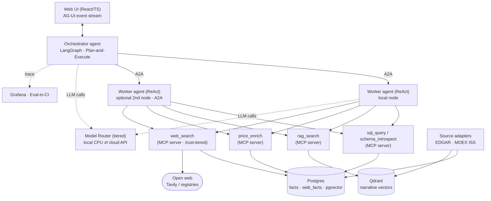

# LedgerLens — Multi-Agent Financial Analysis Platform

[](https://github.com/zzlawlzz/ledgerlens/actions/workflows/ci.yml)
[](https://github.com/zzlawlzz/ledgerlens/actions/workflows/eval.yml)

**English** · [Русский](README.ru.md)

A self-hostable multi-agent platform for financial analysis. Ask a question in
plain language → the system builds a multi-step plan → agents (LangGraph +
ReAct) work over structured filing facts (SQL) and narrative disclosures (RAG)
→ you get an answer with numbers, trends and **citations to the primary
source**, streamed reasoning-first into the UI (AG-UI).

> ⚠️ LedgerLens produces analytics over public filings and **does not give
> investment advice**. See the non-advice guardrail below.

**What makes it different — it acts like an analyst, not a search box:**

- **Plans** the work explicitly (Plan-and-Execute orchestrator) instead of
  one-shot prompting.
- **Self-corrects** — re-plans a step when a result is empty or contradictory,
  visibly, in the stream.
- **Cites** every narrative claim back to the exact SEC/MOEX source chunk; a
  groundedness guardrail strips ungrounded synthesis.
- **Reaches the web when the corpus can't answer** — a trust-tiered `web_search`
  (audited filing > official IR/wire > unknown blog) fills gaps for companies or
  figures not in EDGAR, cites each web fact with its domain and confidence, and
  **enriches the database** with what it finds so the same question is answered
  from the DB next time — no repeat search.
- **Knows when to stop** — bounded web searches and fail-fast on genuinely
  unavailable data (a private company, a forward forecast): it says so honestly
  instead of looping.

## Architecture at a glance



Full layer/component breakdown: [ARCHITECTURE.md](ARCHITECTURE.md).

## Features

| Capability | What you see | Proof |
|---|---|---|
| **Conversational UI** | A chat interface with a live narrator ("searching the web…"), an animated plan/step timeline, a rendered markdown answer, cost/token summary, dark/light themes and EN/RU. | [live demo](https://ledgerlens.space/app/) |
| **Streamed plan** | The orchestrator's plan and each step appear live as the run executes (AG-UI). | [demo/self_correction.md](demo/self_correction.md) |
| **Self-correction** | A step that returns nothing gets re-planned and retried, in view. |  |
| **Citations** | Narrative answers carry `sec.gov` / MOEX source links per claim. |  |
| **Trust-tiered web search** | When a company or figure isn't in the corpus, the agent searches the web, badges each source's trust, and caches the facts it finds so the next run answers from the DB. | [live demo](https://ledgerlens.space/app/) |
| **Observability** | Latency, cost, local-vs-cloud split and eval quality in Grafana. |  |

## Quick start (full stack + UI)

```bash
cp .env.example .env   # set DEEPSEEK_API_KEY, POSTGRES_PASSWORD, POSTGRES_RO_PASSWORD, A2A_TOKEN
make demo              # full local stack + ingest on empty DB + smoke
# UI: http://localhost:3000
```

`make demo` brings up postgres, qdrant, ollama (the `local` profile), the
orchestrator, the A2A worker, the MCP tool servers (sql / rag / enrich) and web
(nginx); on an empty database it ingests SEC EDGAR tickers (disk-cached)
together with embeddings, then runs a smoke suite:
numeric questions, a narrative question with citations, the AG-UI protocol and
UI availability.

One-off question by hand (debug endpoint):

```bash
curl -N -X POST http://localhost:8000/api/chat \
     -H "Content-Type: application/json" \
     -d '{"question": "What was the revenue of AAPL in its latest fiscal year?"}'
```

The answer streams as SSE trace events (plan, steps, tool calls, guardrail) and
ends with `run_finished` carrying the answer, `key_values` and citations. The
frontend uses `POST /agui` (the AG-UI protocol). Self-correction scenario:
[demo/self_correction.md](demo/self_correction.md).

## Stack & depth markers

- **Agent protocols:** MCP tool servers · A2A between agents (incl. across
  nodes) · AG-UI event stream to the browser.
- **Pluggable worker nodes:** the orchestrator talks to workers over A2A, so a
  second node is a single entry in `config/workers.yaml` (T-031) — the same
  contract local or remote. The public demo runs one local worker on the
  workstation backend.
- **Tiered LLM routing:** cheap/local CPU inference for classify/extract/guard,
  cloud API (DeepSeek `flash`/`pro`) for planning & synthesis, provider-agnostic
  behind one interface.
- **Web search with trust + enrichment:** a `web_search` MCP tool reaches the
  open web (Tavily API / registries) only when SQL/RAG can't answer, scores each
  source by a domain-trust tier, cross-checks when no single source is trusted,
  and writes the facts it distils into `web_facts` so repeats hit the DB, not the
  network.
- **Eval-in-CI:** a 41-case golden set gated in GitHub Actions
  (`.github/workflows/eval.yml`) with thresholds in
  `config/eval-thresholds.yaml`.
- **Observability:** every run's steps/tokens/cost/latency land in Postgres and
  surface in Grafana (read-only role).
- **Stack:** Python (FastAPI, LangGraph), React/TypeScript, Postgres+pgvector,
  Qdrant, Ollama, Docker Compose. Exact pins: [CONTRACTS.md](CONTRACTS.md).

## Links

- **Live demo:** https://ledgerlens.space/app/ *(public, rate- and budget-limited;
  a workstation backend exposed through a small VPS — DNS-only + Let's Encrypt,
  no CDN proxy in the SSE path — so it may be offline during maintenance).*
- **Grafana dashboards:** `http://localhost:3001` when self-hosting (anonymous
  Viewer) — Operations, Session drill-down, Quality.
- **Benchmark reports:**
  [inference (CPU vs API)](benchmarks/inference/REPORT.md) ·
  [vector store (pgvector vs Qdrant)](benchmarks/vector/REPORT.md).
- **Runbooks:** [MOEX ingest](docs/moex-ingest.md) ·
  [demo seed/snapshot](deploy/demo/README.md) ·
  [demo security](deploy/demo/SECURITY.md).

## Data sources & licensing

- **SEC EDGAR** — free access; requests carry the mandatory `User-Agent` and
  honour SEC rate limits (fair-use / bulk-access terms).
- **MOEX ISS** (RU mode) — Moscow Exchange ISS data is used here **for
  informational / demonstration purposes only**, over the free delayed feed and
  without an API key. Commercial use, redistribution or otherwise profiting from
  ISS data requires a separate agreement with Moscow Exchange. The client caches
  responses (`data/cache/moex`) and paces requests; RU ingest runs from a node
  with clean access (see [docs/moex-ingest.md](docs/moex-ingest.md)).
- Details — §5 of [ARCHITECTURE.md](ARCHITECTURE.md).

## Non-advice disclaimer

LedgerLens analyses **public** company filings and market data. It is **not**
an investment adviser and produces **no** buy/sell/hold recommendations,
price targets or personalised financial advice. A guardrail (`non_advice`)
inspects every synthesized answer and blocks advice-shaped output. Nothing here
is a solicitation to transact in any security. Verify figures against the cited
primary source before relying on them.

## Document map

| Document | What's inside |
|---|---|
| [ARCHITECTURE.md](ARCHITECTURE.md) | Fixed architecture: layers, components, data sources, protocols, topology |
| [IMPLEMENTATION_PLAN.md](IMPLEMENTATION_PLAN.md) | Phased plan, principles, ADRs, risks, Definition of Done |
| [CONTRACTS.md](CONTRACTS.md) | Technical contracts: stack, DDL, metric dictionary, tool schemas, budgets |
| [CHANGELOG.md](CHANGELOG.md) | Release history by gate (G1…G4) |
| [BACKLOG.md](BACKLOG.md) | Developer backlog: tasks T-001…T-046 with specs and acceptance |

## Project status

Gates **G1 ✅ G2 ✅ G3 ✅**. Core tasks T-001…T-034 and T-041 are delivered, and
the demo now runs on the current topology — a **workstation backend** behind a
thin **VPS door** (DNS-only + Let's Encrypt, no CDN proxy in the SSE path) with
the **frontend on GitHub Pages**.

Recently delivered on top of the core:

- **Conversational demo UI** (T-042) — chat interface, live narrator, animated
  plan/step timeline, markdown answers, cost/token summary, dark/light + EN/RU.
- **Trust-tiered web search** (T-043) — fills gaps the corpus can't answer, with
  a domain-trust model and a durable cache.
- **Web enrichment of the DB** (T-045) — facts found on the web are distilled
  into `web_facts` and surfaced to the agent's SQL path, so a repeat question is
  answered from the DB instead of re-searching.
- **Robustness** (T-046) — bounded web searches and fail-fast on genuinely
  unavailable data, so the agent degrades honestly instead of looping.
- **Owner notifications** (T-044) — each public-demo run reports its cost/tokens
  to the owner's Telegram (egressing via the VPS).

The v1.0 release (T-040 / G4) and some hardware-gated steps (local-model
inference, T-037 benchmarks) remain. See [Known limitations](#known-limitations)
for what is intentionally out of scope or still hardware-gated.

## Known limitations

Honest, current constraints of the v1.0 line. None are silent — each is either
tracked to a task/gate or scoped out on purpose.

- **Local model inference is deferred.** The public demo runs entirely on the
  cloud LLM tier (DeepSeek), which is fast and reliable from the workstation's
  wired link. The optional *local* tier — GPU (RX 6900XT via ROCm) on the
  workstation, or CPU inference — is not wired up yet (migration Phase 2). The
  local-CPU part of the [inference benchmark](benchmarks/inference/REPORT.md) and
  the local-model choice (ADR-3) are still pending that setup.
- **Russian data coverage is partial (Q-02).** MOEX ISS is live (SBER / GAZP /
  LKOH) and proves the pluggable adapter interface; e-disclosure and ГИР БО
  remain interface scaffolds, deliberately out of the v1.0 scope. MOEX ISS data
  is used for informational / demonstration purposes only — see
  [Data sources & licensing](#data-sources--licensing).
- **Price-history depth is limited by the free data tier.** The Alpha Vantage
  free key returns only ~100 recent trading days (compact); longer history
  requires a premium key. Prices are cached after first fetch.
- **Benchmarks exclude GPU (Q-07).** Only local-CPU vs cloud-API inference is
  compared; the vLLM / GPU benchmark is deferred by design.
- **The public demo is scope-limited.** It serves the US / EDGAR corpus only and
  applies per-IP rate, concurrency and daily-cost caps — it is a showcase, not
  an SLA-backed service.
