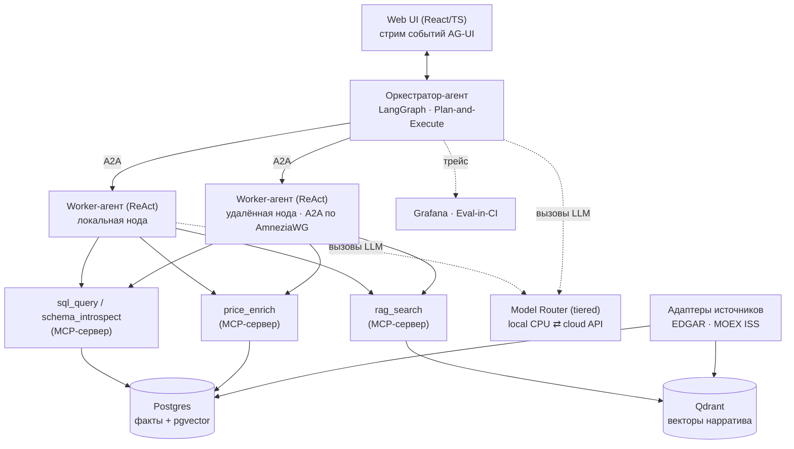
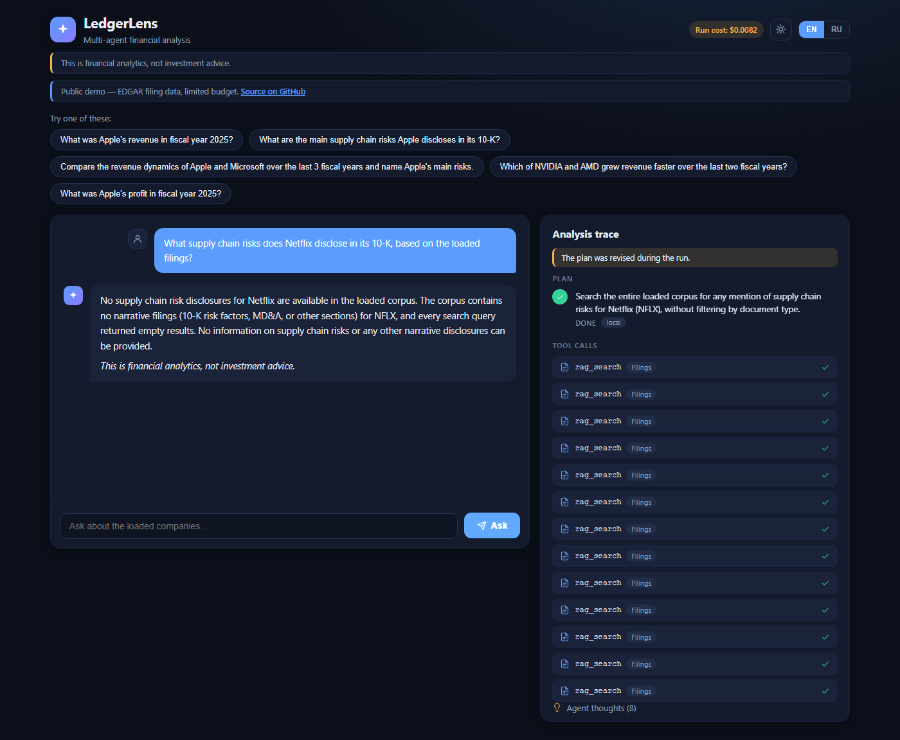
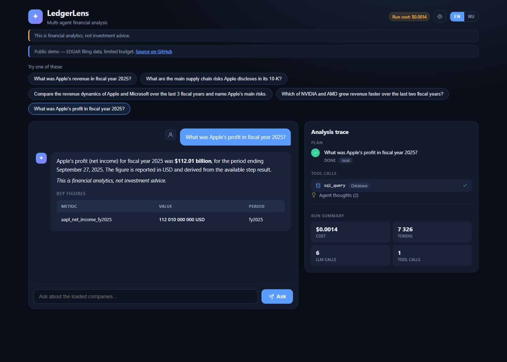
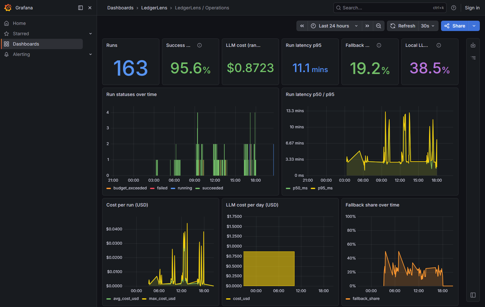

# LedgerLens — мультиагентная платформа финансового анализа

[](https://github.com/zzlawlzz/ledgerlens/actions/workflows/ci.yml)
[](https://github.com/zzlawlzz/ledgerlens/actions/workflows/eval.yml)

[English](README.md) · **Русский**

Self-hostable мультиагентная платформа финансового анализа. Вопрос на
естественном языке → многошаговый план → агенты (LangGraph + ReAct) работают с
фактами отчётности (SQL) и нарративом (RAG) → ответ с числами, динамикой и
**цитатами на первоисточник**, со стримом хода рассуждения в UI (AG-UI).

> ⚠️ LedgerLens даёт аналитику по публичной отчётности и **не даёт
> инвестиционных рекомендаций**. См. guardrail non-advice ниже.

**Чем отличается — ведёт себя как аналитик, а не как поисковая строка:**

- **Планирует** работу явно (оркестратор Plan-and-Execute), а не отвечает
  one-shot-промптом.
- **Самокорректируется** — переигрывает шаг, если результат пуст или
  противоречив, видимо, прямо в стриме.
- **Цитирует** каждое нарративное утверждение обратно к конкретному чанку
  источника SEC/MOEX; guardrail groundedness срезает необоснованный синтез.

## Архитектура в одном взгляде



Полная разбивка по слоям/компонентам: [ARCHITECTURE.md](ARCHITECTURE.md).

## Возможности

| Возможность | Что видно | Пруф |
|---|---|---|
| **Стрим плана** | План оркестратора и каждый шаг появляются живьём по мере исполнения (AG-UI). | [demo/self_correction.md](demo/self_correction.md) |
| **Самокоррекция** | Шаг, вернувший пусто, переигрывается и повторяется на виду. |  |
| **Цитаты** | Нарративные ответы несут ссылки `sec.gov` / MOEX на каждое утверждение. |  |
| **Наблюдаемость** | Латентность, стоимость, local-vs-cloud и качество eval в Grafana. |  |

> Пока статические скриншоты; анимированные GIF трёх сценариев вынесены в
> задачу T-039 (сайт-презентация).

## Быстрый старт (полный стек + UI)

```bash
cp .env.example .env   # заполнить DEEPSEEK_API_KEY, POSTGRES_PASSWORD, POSTGRES_RO_PASSWORD, A2A_TOKEN
make demo              # полный локальный стек + ingest при пустой БД + смоук
# UI: http://localhost:3000
```

`make demo` поднимает postgres, qdrant, ollama (профиль `local`), оркестратор,
A2A-воркер, MCP-серверы инструментов (sql / rag / enrich) и web (nginx); при
пустой БД загружает тикеры из SEC EDGAR (с диск-кэшем) вместе с эмбеддингами и
прогоняет смоук: числовые вопросы,
нарративный вопрос с цитатами, протокол AG-UI, доступность UI.

Разовый вопрос вручную (debug-эндпоинт):

```bash
curl -N -X POST http://localhost:8000/api/chat \
     -H "Content-Type: application/json" \
     -d '{"question": "What was the revenue of AAPL in its latest fiscal year?"}'
```

Ответ стримится как SSE-поток трейс-событий (план, шаги, вызовы инструментов,
guardrail) и завершается `run_finished` с ответом, `key_values` и цитатами.
Фронт использует `POST /agui` (протокол AG-UI). Сценарий самокоррекции —
[demo/self_correction.md](demo/self_correction.md).

## Стек и маркеры глубины

- **Агентские протоколы:** MCP-серверы инструментов · A2A между агентами (в т.ч.
  между нодами) · стрим событий AG-UI в браузер.
- **Топология двух нод:** воркер работает локально или на удалённом VPS через
  меш AmneziaWG (T-031, гейт G3) — один и тот же A2A-контракт в обоих случаях.
- **Tiered-роутинг LLM:** дешёвый/локальный CPU-инференс на
  classify/extract/guard, cloud API (DeepSeek `flash`/`pro`) на планирование и
  синтез, провайдер-агностично за единым интерфейсом.
- **Eval-in-CI:** golden-набор из 41 кейса с гейтом в GitHub Actions
  (`.github/workflows/eval.yml`), пороги в `config/eval-thresholds.yaml`.
- **Наблюдаемость:** шаги/токены/стоимость/латентность каждого прогона пишутся в
  Postgres и видны в Grafana (read-only роль).
- **Стек:** Python (FastAPI, LangGraph), React/TypeScript, Postgres+pgvector,
  Qdrant, Ollama, Docker Compose. Точные пины — [CONTRACTS.md](CONTRACTS.md).

## Ссылки

- **Живое демо:** https://app.ledgerlens.space *(публичное, с лимитами по частоте
  и бюджету; едет с self-hosted-ноды за Cloudflare Tunnel — может быть недоступно
  во время обслуживания).*
- **Дашборды Grafana:** `http://localhost:3001` при self-host (анонимный Viewer)
  — Operations, Session drill-down, Quality.
- **Отчёты бенчмарков:**
  [инференс (CPU vs API)](benchmarks/inference/REPORT.md) ·
  [векторное хранилище (pgvector vs Qdrant)](benchmarks/vector/REPORT.md).
- **Рунбуки:** [MOEX ingest](docs/moex-ingest.md) ·
  [seed/snapshot демо](deploy/demo/README.md) ·
  [безопасность демо](deploy/demo/SECURITY.md).

## Источники данных и лицензии

- **SEC EDGAR** — бесплатный доступ; запросы уходят с обязательным `User-Agent`
  и rate-limit согласно правилам SEC (fair-use / bulk-access).
- **MOEX ISS** (RU-режим) — данные ИСС Московской биржи используются здесь
  **только в ознакомительных/демонстрационных целях**, по бесплатному
  задержанному фиду и без API-ключа. Коммерческое использование, перепродажа или
  иное извлечение прибыли из данных ISS требуют отдельного соглашения с
  Московской биржей. Клиент кэширует ответы (`data/cache/moex`) и держит паузу
  между запросами; ingest RU-источников выполняется с ноды с чистым доступом
  (см. [docs/moex-ingest.md](docs/moex-ingest.md)).
- Подробнее — §5 [ARCHITECTURE.md](ARCHITECTURE.md).

## Дисклеймер non-advice

LedgerLens анализирует **публичную** отчётность компаний и рыночные данные. Это
**не** инвестиционный советник, он **не** выдаёт рекомендаций
купить/продать/держать, целевых цен или персонального финансового совета.
Guardrail (`non_advice`) проверяет каждый синтезированный ответ и блокирует
советообразный вывод. Ничто здесь не является призывом к сделкам с ценными
бумагами. Сверяйте числа с процитированным первоисточником, прежде чем на них
полагаться.

## Карта документов

| Документ | Что в нём |
|---|---|
| [ARCHITECTURE.md](ARCHITECTURE.md) | Зафиксированная архитектура: слои, компоненты, источники данных, протоколы, топология |
| [IMPLEMENTATION_PLAN.md](IMPLEMENTATION_PLAN.md) | Фазовый план, принципы, ADR, риски, Definition of Done |
| [CONTRACTS.md](CONTRACTS.md) | Технические контракты: стек, DDL, словарь метрик, схемы инструментов, бюджеты |
| [CHANGELOG.md](CHANGELOG.md) | История релизов по гейтам (G1…G4) |
| [BACKLOG.md](BACKLOG.md) | Бэклог разработчика: задачи T-001…T-041 с ТЗ и критериями |

## Статус проекта

Гейты **G1 ✅ G2 ✅**. Ключевые задачи T-001…T-030 и T-032…T-034 сделаны.
Оставшаяся работа фазы 4 — деплой второй ноды (T-031 / G3), Telegram-алертинг
(T-035), публичное демо (T-036), бенчмарки (T-037) и релиз v1.0 (T-040 / G4) —
в работе, с остатком из живых/железо-зависимых шагов. Текущие известные
ограничения:

- **faithfulness** — метрика groundedness временно `non_blocking` в eval-гейте,
  пока не закрыт T-041 (синтез не должен дополнять retrieved-контекст) —
  считается и репортится, но пока не роняет CI.
- **Развёртывание на двух нодах** (T-031, гейт G3): диспетчер с round-robin +
  local-preferred failover готов; остаётся живой деплой удалённой ноды через
  AmneziaWG.
- **Локальный CPU-тир** медленный на dev-ноутбуке; мультишаговые вопросы
  занимают минуты. Целевое железо — домашняя нода (см. [бенчмарк
  инференса](benchmarks/inference/REPORT.md), local-CPU-часть ждёт ноду).
