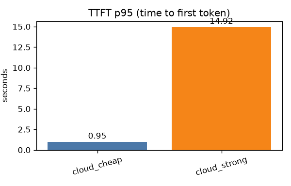
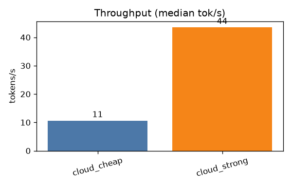
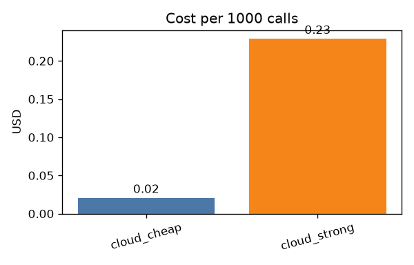
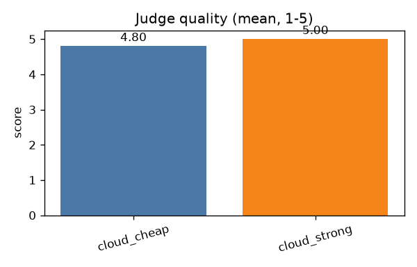

# Inference benchmark — local CPU vs cloud API (T-037 §1)

_Auto-generated by `benchmarks/inference/bench.py` (2026-07-12 18:33:17)._

## Setup

- **Suite:** 20 prompts across 4 task classes (route, extract, plan, synthesize), 1 repeat(s) each — see `prompts.py`.
- **Metrics:** TTFT (first streamed signal), tok/s (output tokens ÷ full latency, end-to-end), latency (p50/p95), USD cost, judge quality (1–5).
- **Pricing:** API from `config/prices.yaml` (same table the orchestrator meters with); local (ollama) is $0 at the meter — see amortisation note below.
- **Hardware:** Windows-11-10.0.22631-SP0; 24 logical CPUs. _(Replace with the EPYC node's spec when the local candidates are run.)_

## Results

| Model | Provider | Calls | Err | TTFT p50 | TTFT p95 | Lat p50 | Lat p95 | tok/s (med) | $/1k calls | Quality |
|---|---|--:|--:|--:|--:|--:|--:|--:|--:|--:|
| `deepseek-v4-flash` | deepseek | 20 | 0 | 0.74s | 0.95s | 1.13s | 1.82s | 11 | $0.02 | 4.80 |
| `deepseek-v4-pro` | deepseek | 20 | 0 | 2.75s | 14.92s | 3.17s | 15.81s | 44 | $0.23 | 5.00 |

### Quality by task class (judge score 1–5)

| Model | route | extract | plan | synthesize |
|---|--:|--:|--:|--:|
| `deepseek-v4-flash` | 4.20 | 5.00 | 5.00 | 5.00 |
| `deepseek-v4-pro` | 5.00 | 5.00 | 5.00 | 5.00 |

## Charts

## ADR-3 — local model choice

> Fill in once the local candidates run on the home node. The default `LOCAL_MODEL` in `config/router.yaml` should be the CPU candidate whose tok/s and TTFT keep the cheap task classes (route/extract/guard) under the `local` tier's `timeout_s`, at acceptable judge quality. Cloud tiers handle plan/synthesize regardless (see policy).

## Notes & limitations

- **No GPU / vLLM column (Q-07).** GPU inference was excluded by owner decision; we do not publish anyone else's GPU throughput as our own. The local column is CPU-only (2×EPYC 7551), API column is the paid tier.
- **Local $ is an estimate, not a meter.** Ollama calls cost $0 in the table (no API charge). Real local cost is electricity + hardware amortisation on an already-owned node — treat the API $/1k as the marginal-cost comparison, not a claim that local is free.
- **tok/s is end-to-end output throughput** = output tokens ÷ full latency. This is apples-to-apples across a genuinely token-streaming model (cloud_cheap) and one that buffers reasoning+answer into a final burst (cloud_strong, `thinking=enabled`) — a generation-phase tok/s of `tokens/(latency−TTFT)` explodes when TTFT≈latency. When an endpoint returns no usage, output tokens are estimated at ≈4 chars/token (flagged; DeepSeek returns real usage, some ollama builds do not).
- **TTFT = first streamed signal of any kind**, including a reasoning model's chain-of-thought; for `thinking=enabled` the answer arrives as one burst, so TTFT≈latency reflects real perceived wait.
- Single-thread, warm client; no concurrency modelling. Outputs are length-bounded by each prompt's system message so tok/s compares generation speed, not verbosity.

