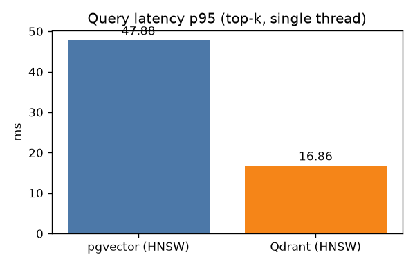
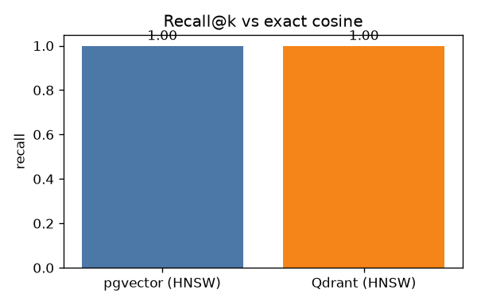
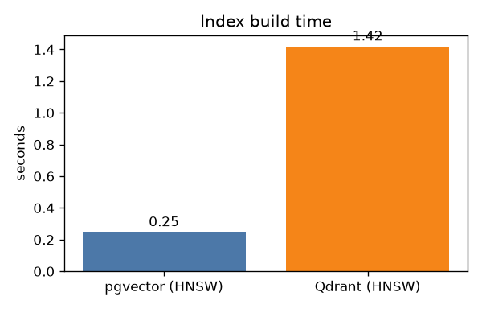

# Vector store benchmark — pgvector vs Qdrant (T-037)

_Auto-generated by `benchmarks/vector/bench.py` (2026-07-12 04:18:45)._

## Setup

- **Corpus:** 1109 vectors, 1024-dim, cosine (real `narrative_chunks` embeddings = 1109).
- **Queries:** 200 e5-large query embeddings (≈50 curated finance questions + templated over corpus companies).
- **k:** 10. **Ground truth:** exact brute-force cosine over the same set.
- **HNSW (both):** m=16, ef_construction=64, ef_search=64.
- **Hardware:** Windows-11-10.0.22631-SP0; 24 logical CPUs, numpy 2.5.1. _(dev machine — replace with the target node's spec when publishing.)_

> Recall here measures ANN **approximation** quality (agreement with exact nearest neighbours on the identical set), not semantic relevance — the eval harness covers relevance. Synthetic vectors (scale > 1) are perturbations, so they stress the index, not the retriever.

## Results

| Store | Build | Recall@10 | Latency mean | p50 | p95 | Index size |
|---|--:|--:|--:|--:|--:|--:|
| pgvector (HNSW) | 0.25s | 1.000 | 44.81 ms | 43.81 ms | 47.88 ms | 0.0 MB |
| Qdrant (HNSW) | 1.42s | 1.000 | 8.79 ms | 4.15 ms | 16.86 ms | n/a |

- **pgvector (HNSW)** — m=16, ef_construction=64, ef_search=64.
- **Qdrant (HNSW)** — m=16, ef_construct=64, hnsw_ef=64, indexing_threshold=100. indexed_vectors=1109.

## Charts

## Notes & limitations

- Single-thread, warm-cache latency; no concurrency modelling.
- Qdrant `indexing_threshold` is lowered so HNSW is actually built at small N (its default 20k would answer exactly and skew the comparison).
- Qdrant exposes no per-collection byte size over the API; pgvector index size is `pg_relation_size`. Compare build time / recall / latency, not raw bytes.
- Hybrid (dense+BM25) is Qdrant-only in this stack and is out of scope here (dense-vs-dense keeps the comparison apples-to-apples).
